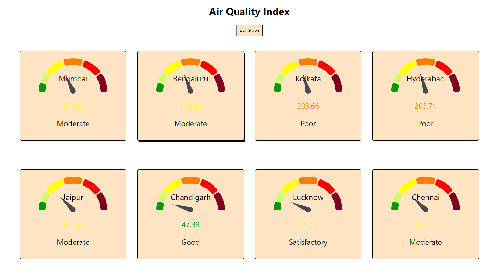
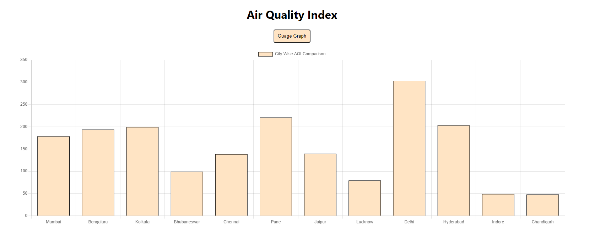

# Air Quality Index

## About Project

This is single page application (SPA) to display live air monitoring data.
It is hosted on Netlify. To visit please click [here](https://pl-aqi.netlify.app/)

The Application has two view

## Guage View

## Bar Graph View

## Libraries Used

- react-chartjs-2
- react-gauge-chart

## Time Taken

It took me one day to develop this. Most of the time was invested in selecting the graph library and building data needed for charts.
